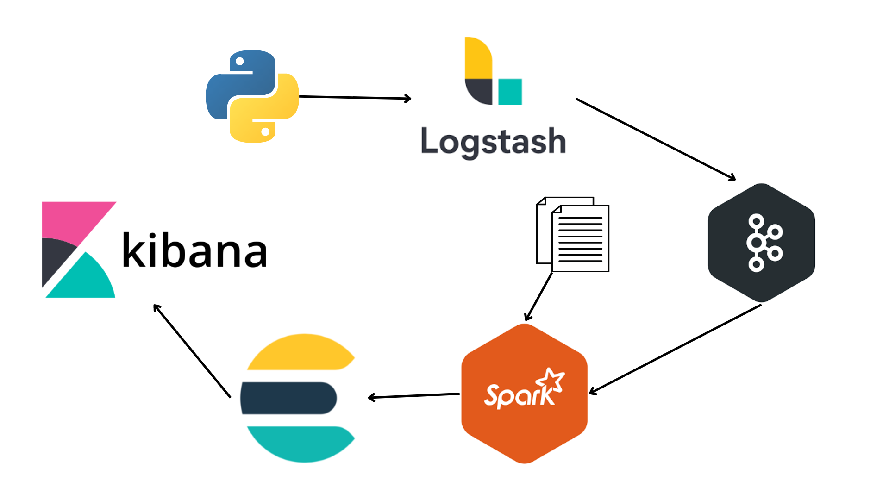

# Reddit Classificator

In questo tutorial si vuole costruire un sistema di classificazione real-time che permetta di suddividere i post di reddit in categorie, per poi visualizzarne graficamente i risultati. L'obbiettivo è quello di riuscire a predire l'argomento dei post, sulla base del solo titolo, evitando quindi che l'utente debba cliccarci.

## Data flow




## Quickstart

Per poter eseguire la repo, è necessario creare un file .env all'interno della cartella "server". Questo dovrà contenere le credenziali per effettuare le richieste a reddit. Per qualsiasi informazione consiglio la <a href="https://www.jcchouinard.com/get-reddit-api-credentials-with-praw/" target="_blank">guida</a>


```
git clone https://github.com/Giovannimbesi25/Reddit-Post-Classificator.git
cd Reddit-Post-Classificator
docker-compose up

```
## Possible Error
**ERROR: for kibana  Container "id container" is unhealthy** 

Possible Solution: sudo sysctl -w vm.max_map_count=262144

## Useful Links

| Container  | URL |Description|
| ------------- | ------------- | ------- |
|  kafka-UI  |  http://localhost:8080  |    Open kafka UI |
| kibana  | http://localhost:5601  |    Kibana base URL |
| elasticsearch  | http://localhost:9200 |    ElasticSearch base URL |

## Attenzione

All'interno della repo è presente il dataset utilizzato per allenare il modello, per cui il download potrebbe richiedere un pò di tempo.
Grazie a Kaggle per aver messo a disposizione i dati.


## Authors
**Imbesi Giovanni**
